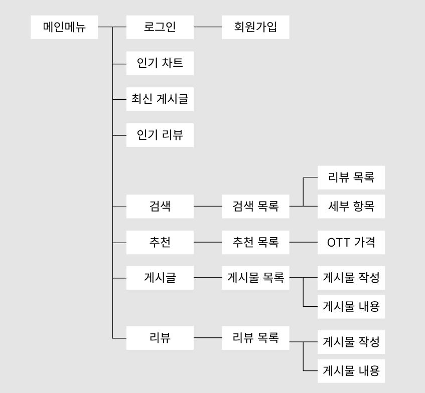
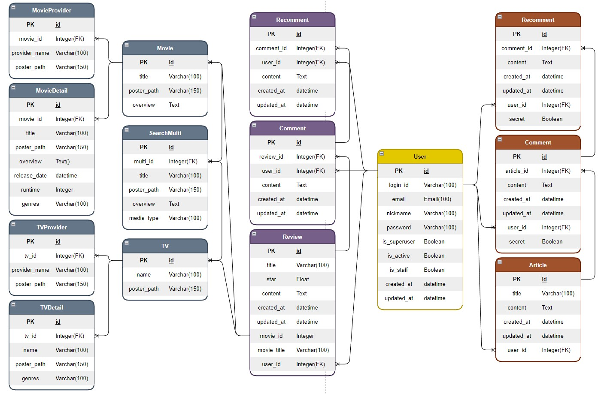

# OTTDA(웃다)

## 소개
#### 지속적인 OTT 구독자 수 상승
  * 바쁜 일상으로 모든 영화 및 tv 프로를 챙겨보지 못함.
  * OTT를 이용한 다시보기 서비스를 이용하여 원하는 영상을 편하게 감상 가능.
  * **각 영상별로 시청할 수 있는 OTT 검색**

#### 많아지는 OTT의 종류 및 요금제
  * 많은 기업에서 새로운 OTT 서비스를 출시.
  * 화질, 동시 시청 등을 기반으로 다양한 종류의 요금제 출시.
  * **원하는 영상을 모두 볼 수 있는 효율적인 OTT 조합 추천**

#### 사용자 간의 소통
  * 각 OTT 별로 original 시리즈를 출시
  * OTT 별로 새로 추가될 영상 소식 공유
  * 영화, tv 프로에 대한 리뷰 수집.
  * **정보 공유, 리뷰 작성 게시판**

## 요구사항

  
상세 내용 확인

  

### 요구사항 명세서

| 기능 | 설명 |
| --- | --- |
| 영상 OTT 검색 | 영상을 볼수 있는 OTT 리스트 제공 |
| OTT 추천 | 선택한 영상을 볼 수 있는 가장 효율적인 OTT 조합 추천 |
| 영화, tv 랭크 | TMDB의 API를 이용한 영화, tv 정보 |
| 게시판 | 함께 OTT를 결제할 사람을 모집하거나 정보를 공유할 수 있는 게시판 |
| 리뷰 게시판 | 영상에 대한 리뷰 작성 가능한 게시판 |

  

## 설계

  
상세 내용 확인

  

  
### 메뉴 구성도

### ERD

  

## 개발 환경
| 구분 | 개발환경 | 개발도구 | 개발언어 |
| --- | --- | --- | --- |
| Front | VSCode | Vue.js | HTML&CSS&JS |
| Back | VSCode | Django | Python |
| Server | AWS EC2 |  |  |
| Design | Figma |  |  |

## API

  
상세 내용 확인

  

  
[Home](https://github.com/subin3277/OTTDA_vue/wiki)

  

## 총평
### 아쉬운 점
  * 시간이 부족해 성공적으로 배포를 하지 못해 아쉬웠다.
  * 초반 디자인을 하기가 어려웠으며, 프로토타입을 만든대로 구현하기에도 미숙했다.
  * 프로젝트를 진행하면서 개선 혹은 추가하고 싶은 기능들(회원탈퇴, 프로필 수정 등)이 많았다. 하지만 기간이 짧았던 만큼 모두 구현하지는 못하였다.

### 배운 점
  * Front
    * 여러 라이브러리 및 bootstrap을 이용하여 FrontEnd의 역할 뿐만 아니라 publisher의 역할도 함께 해보았다.
    * axios를 사용하여 비동기에 대해 조금 더 익숙해질 수 있었고, Auth와 token도 활용해보았다.
    * netlify를 이용하여 웹 배포를 해보았다.
    * Vue.js의 구조에 대해 더 이해할 수 있었다.
  * Back
    * tmdb에서 json을 불러오면서 다양한 형태의 데이터를 처리하는 데에 익숙해질 수 있었다.
    * simple-jwt로 로그인, 회원가입, 로그아웃을 구현해볼 수 있었다.
    * Serializer을 이용해서 데이터 구조를 단순화할 수 있었다.
  
